# 🔐 Supervision des ACL (Sécurité Réseau) – Projet GNS3

## 📌 Introduction

Dans les réseaux modernes, les **Access Control Lists (ACL)** jouent un rôle essentiel dans la **sécurisation du trafic**. Elles permettent de contrôler les communications entre différentes zones réseau, de filtrer les paquets selon une politique de sécurité définie et de limiter les accès non autorisés.

Dans le cadre de ce projet, une maquette réseau a été conçue et déployée sous **GNS3** afin de mettre en œuvre un mécanisme de **supervision des ACL**. Le travail demandé consistait à :

- **monitorer les ACL** ;
- **analyser le trafic bloqué** ;
- **détecter les anomalies** ;
- produire des **KPI de sécurité** ;
- rédiger un **rapport d’analyse**.

L’objectif principal est donc de montrer, dans un environnement simulé, comment une ACL peut être configurée pour protéger un réseau sensible, comment les tentatives d’accès interdites peuvent être observées, et comment les résultats obtenus peuvent être exploités dans une démarche de supervision réseau.

---

## 🎯 Objectifs du projet

Ce projet vise à atteindre les objectifs suivants :

1. Concevoir une architecture réseau simple et claire sous GNS3.
2. Configurer les équipements réseau nécessaires au routage entre deux LAN.
3. Déployer une **ACL étendue** afin de contrôler le trafic entre un réseau utilisateur et un réseau administrateur.
4. Vérifier la connectivité réseau avant l’activation du filtrage.
5. Observer les effets de l’ACL après sa mise en place.
6. Mesurer le nombre de paquets bloqués à l’aide des compteurs ACL.
7. Déduire, à partir des résultats obtenus, des **indicateurs de sécurité** et une **analyse des anomalies**.

---

## 🏗️ Architecture réseau

L’architecture réalisée se compose des éléments suivants :

- **R1** : routeur frontière, connecté au Cloud, jouant le rôle de passerelle externe ;
- **R2** : routeur interne, assurant le routage entre les réseaux locaux ;
- **Switch1** : commutateur du réseau administrateur ;
- **Switch2** : commutateur du réseau utilisateur ;
- **PC2** : machine du **LAN1** (réseau administrateur) ;
- **PC1** : machine du **LAN2** (réseau utilisateur) ;
- **Cloud1** : simulation d’un réseau externe.

L’idée de cette architecture est de séparer deux réseaux logiques :

- **LAN1** : réseau administrateur, considéré comme sensible ;
- **LAN2** : réseau utilisateur, soumis à des restrictions.

L’ACL sera utilisée pour **empêcher le LAN2 d’accéder au LAN1**, tout en laissant passer le reste du trafic autorisé.

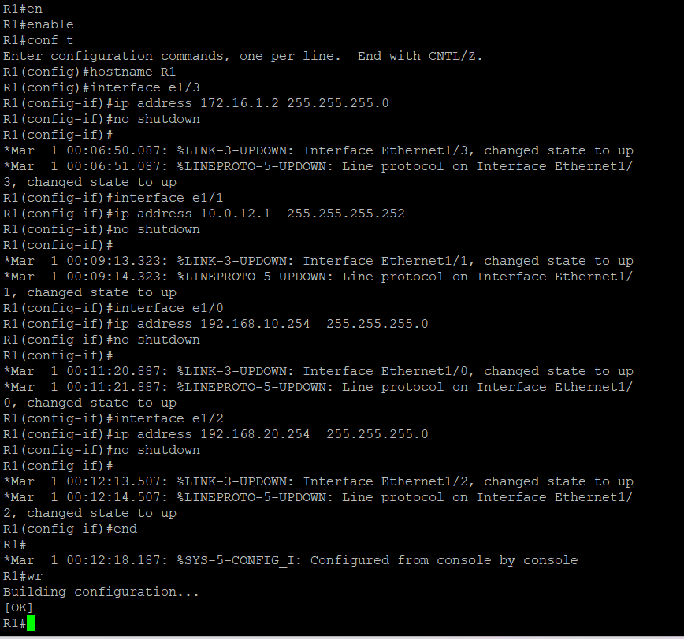

---

## 🌐 Plan d’adressage IP

Le plan d’adressage retenu est le suivant :

| Équipement | Interface | Adresse IP | Rôle |
|---|---|---|---|
| R1 | e1/3 | 172.16.1.2/24 | Connexion vers Cloud |
| R1 | e1/1 | 10.0.12.1/30 | Lien point à point vers R2 |
| R1 | e1/0 | 192.168.10.254/24 | Interface vers LAN1 |
| R1 | e1/2 | 192.168.20.254/24 | Interface vers LAN2 |
| R2 | e1/0 | 10.0.12.2/30 | Lien point à point vers R1 |
| R2 | e1/2 | 192.168.10.1/24 | Passerelle du LAN1 |
| R2 | e1/3 | 192.168.20.1/24 | Passerelle du LAN2 |
| PC2 | e0 | 192.168.10.10/24 | Machine Admin |
| PC1 | e0 | 192.168.20.10/24 | Machine User |

Cette organisation permet de distinguer clairement :

- un **réseau administrateur** : `192.168.10.0/24` ;
- un **réseau utilisateur** : `192.168.20.0/24` ;
- un **lien inter-routeurs** : `10.0.12.0/30`.

---

## ⚙️ Configuration des routeurs

### 🔹 Configuration du routeur R1

Le routeur **R1** a été configuré avec :

- une interface connectée au Cloud ;
- une interface vers R2 ;
- une interface vers le LAN1 ;
- une interface vers le LAN2.

Les captures suivantes montrent la configuration progressive des interfaces de R1.

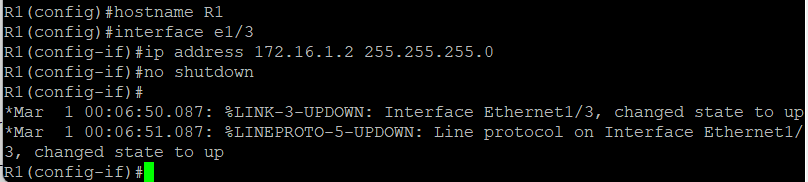
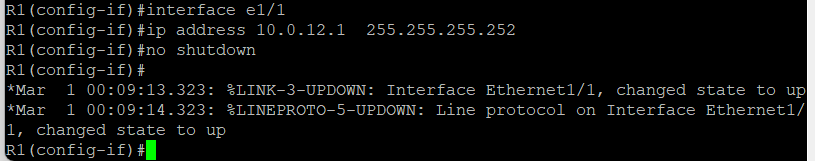
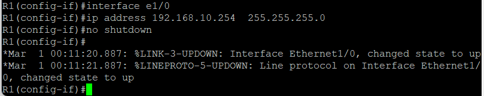
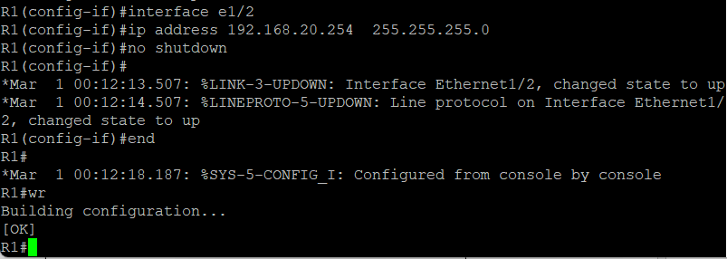

Les paramètres essentiels de R1 sont :

- `e1/3 = 172.16.1.2/24`
- `e1/1 = 10.0.12.1/30`
- `e1/0 = 192.168.10.254/24`
- `e1/2 = 192.168.20.254/24`

Ces interfaces permettent à R1 de relier l’environnement externe au réseau interne.

---

### 🔹 Configuration du routeur R2

Le routeur **R2** joue un rôle central dans le filtrage et le routage entre les deux LAN. Il a été configuré avec :

- une interface vers R1 ;
- une interface vers le LAN1 ;
- une interface vers le LAN2.

Les captures suivantes montrent la configuration de R2.

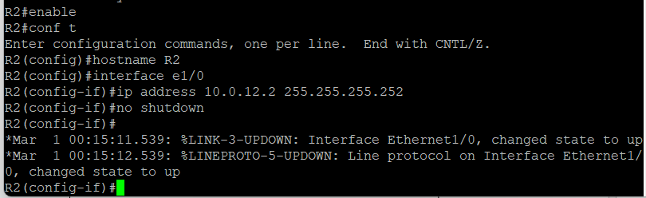
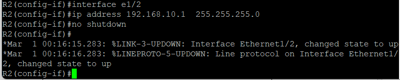
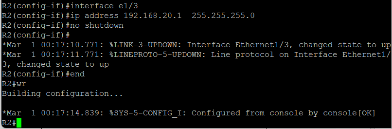

Les paramètres essentiels de R2 sont :

- `e1/0 = 10.0.12.2/30`
- `e1/2 = 192.168.10.1/24`
- `e1/3 = 192.168.20.1/24`

Ces adresses font de R2 la passerelle principale des deux réseaux locaux.

---

## 💻 Configuration des machines VPCS

Deux machines **VPCS** ont été utilisées pour simuler les hôtes du réseau.

### 🔹 Configuration de PC1

PC1 appartient au réseau utilisateur **LAN2**.

- Adresse IP : `192.168.20.10`
- Masque : `255.255.255.0`
- Passerelle : `192.168.20.1`

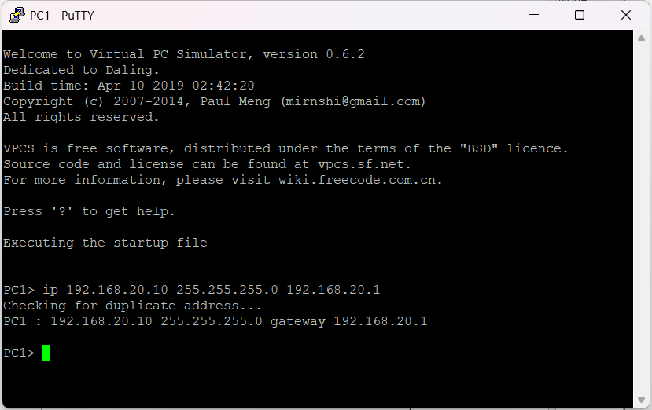

### 🔹 Configuration de PC2

PC2 appartient au réseau administrateur **LAN1**.

- Adresse IP : `192.168.10.10`
- Masque : `255.255.255.0`
- Passerelle : `192.168.10.1`

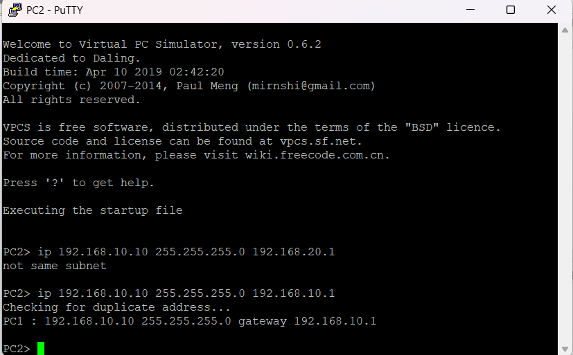

---

## 🧪 Vérification de la connectivité avant ACL

Avant d’appliquer toute politique de filtrage, il était indispensable de vérifier que le réseau fonctionnait correctement. Cette étape permet de s’assurer que les éventuels blocages observés ensuite proviennent bien des ACL et non d’un problème d’adressage ou de routage.

### 🔹 Test entre les deux machines

Depuis **PC1**, un ping a été lancé vers **PC2**.


Le résultat montre que la communication est **autorisée** avant l’application de l’ACL.

Depuis **PC2**, un ping a également été lancé vers **PC1**.


Ce second test confirme que la communication entre les deux LAN est fonctionnelle dans les deux sens avant la mise en place du filtrage.

### 🔹 Vérification des passerelles

Une vérification complémentaire a été réalisée entre chaque machine et sa passerelle, ainsi qu’avec l’interface correspondante sur R1.

#### PC1 vers sa passerelle et vers R1


On observe que **PC1** communique correctement avec :

- sa passerelle `192.168.20.1` ;
- l’interface R1 `192.168.20.254`.

#### PC2 vers sa passerelle et vers R1


On observe que **PC2** communique correctement avec :

- sa passerelle `192.168.10.1` ;
- l’interface R1 `192.168.10.254`.

### ✅ Conclusion de cette étape

Avant l’activation des ACL :

- l’adressage IP est correct ;
- les passerelles répondent ;
- les deux LAN peuvent communiquer entre eux.

Cette étape valide la **bonne connectivité initiale** du réseau.

---

## 🔒 Mise en place de l’ACL

Une **ACL étendue** a été configurée sur le routeur **R2** pour répondre à la politique de sécurité suivante :

> Le réseau utilisateur **LAN2** ne doit pas pouvoir accéder au réseau administrateur **LAN1**.

### 🔹 Politique appliquée

Les règles choisies sont les suivantes :

- **bloquer** tout trafic provenant de `192.168.20.0/24` vers `192.168.10.0/24` ;
- **journaliser** les tentatives bloquées grâce à l’option `log` ;
- **autoriser** tout le reste du trafic avec `permit ip any any`.

### 🔹 Configuration ACL

```bash
ip access-list extended BLOCK-LAN2
 deny ip 192.168.20.0 0.0.0.255 192.168.10.0 0.0.0.255 log
 permit ip any any
```

### 🔹 Application sur l’interface concernée

L’ACL a été appliquée en entrée sur l’interface **e1/3** de R2, c’est-à-dire l’interface connectée au réseau utilisateur LAN2.

```bash
interface e1/3
 ip access-group BLOCK-LAN2 in
```

La capture suivante montre la configuration mise en place.


---

## 🚫 Tests réalisés après application de l’ACL

Une fois l’ACL activée, les tests de communication ont été relancés afin d’observer l’effet du filtrage.

### 🔹 Test de PC1 vers PC2 après ACL

Depuis **PC1** (réseau utilisateur), un ping a été lancé vers **PC2** (réseau administrateur).


Le message affiché est :

```text
communication administratively prohibited
```

### ✅ Interprétation

Ce message signifie que :

- le paquet a bien atteint le routeur ;
- le routeur a identifié qu’il ne respectait pas la politique de sécurité ;
- le trafic a été bloqué de manière explicite par l’ACL.

Cela constitue une preuve claire que le filtrage ne provient pas d’un problème technique, mais bien d’une **règle de sécurité appliquée volontairement**.

### 🔹 Comportement observé dans l’autre sens

Le réseau administrateur reste prioritaire et contrôlé. Selon la politique retenue, l’objectif principal était avant tout de **protéger LAN1 contre les accès provenant de LAN2**.

---

## 📊 Supervision des ACL

La supervision des ACL a été réalisée à l’aide de la commande :

```bash
show ip access-lists
```

Le résultat observé est présenté ci-dessous.

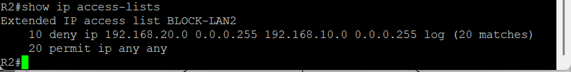

### ✅ Analyse des compteurs

Le compteur associé à la règle de blocage montre un certain nombre de **matches**. Cela indique que la règle a été déclenchée plusieurs fois.

Dans la capture, on observe notamment :

- la présence de la règle `deny ip 192.168.20.0 0.0.0.255 192.168.10.0 0.0.0.255 log` ;
- l’augmentation du compteur de paquets bloqués ;
- la règle `permit ip any any` permettant le reste du trafic.

### ✅ Importance de cette supervision

Ces compteurs sont essentiels car ils permettent de :

- vérifier que l’ACL est réellement utilisée ;
- mesurer le volume de trafic bloqué ;
- identifier une activité suspecte ou répétitive ;
- générer des indicateurs de sécurité exploitables.

---

## 🚨 Détection d’anomalies

L’un des objectifs du projet était de **détecter des anomalies** à partir de l’observation du trafic bloqué.

### 🔹 Anomalie simulée

Une série de tentatives de communication a été générée depuis **PC1** vers **PC2**, alors que cette communication n’est pas autorisée par la politique de sécurité.

### 🔹 Symptômes observés

- les requêtes ICMP sont rejetées ;
- le routeur renvoie une réponse indiquant un blocage administratif ;
- les compteurs ACL augmentent à chaque nouvelle tentative.

### 🔹 Interprétation sécurité

Ce comportement peut être considéré comme une **anomalie réseau** ou une **tentative d’accès non autorisé**, car :

- un poste du réseau utilisateur tente d’atteindre une ressource d’un réseau protégé ;
- la politique de sécurité interdit explicitement cet accès ;
- l’activité est répétée et visible dans les compteurs.

Ainsi, l’ACL ne se contente pas de bloquer le trafic : elle sert également de **mécanisme de supervision**, car elle rend possible l’observation et l’analyse des événements réseau.

---

## 📈 KPI de sécurité

À partir des résultats obtenus, plusieurs **indicateurs de performance sécurité** peuvent être extraits.

| KPI | Observation |
|---|---|
| Nombre de paquets bloqués | visible dans les compteurs ACL |
| Réseau source suspect | `192.168.20.0/24` |
| Réseau protégé | `192.168.10.0/24` |
| Type de trafic bloqué | trafic IP / ICMP |
| Détection d’une anomalie | oui |
| Journalisation des tentatives | oui, via `log` |

### 🔹 Exemple d’analyse KPI

Les KPI montrent que :

- le réseau utilisateur a tenté d’accéder au réseau administrateur ;
- les accès ont été systématiquement bloqués ;
- la politique de sécurité est respectée ;
- les événements sont observables et donc exploitables dans un rapport de supervision.

---

## ✅ Résultats obtenus

À l’issue du projet, les résultats suivants ont été obtenus :

- la topologie a été correctement déployée sous GNS3 ;
- l’adressage IP a été configuré avec succès ;
- la communication entre les deux LAN a été validée avant filtrage ;
- une ACL étendue a été déployée sur R2 ;
- l’accès de LAN2 vers LAN1 a été bloqué ;
- les tentatives interdites ont été comptabilisées ;
- les informations collectées permettent d’établir un rapport de supervision.

---

## 🏁 Conclusion

L’objectif de ce projet était de réaliser une **supervision des ACL** dans un environnement simulé. Grâce à l’outil **GNS3**, une architecture simple mais représentative a été mise en place afin de tester le comportement d’une politique de filtrage entre deux réseaux distincts.

Les résultats montrent que :

- la connectivité initiale du réseau était correcte ;
- l’ACL configurée sur R2 bloque efficacement les accès non autorisés ;
- les compteurs ACL permettent de superviser les tentatives d’accès ;
- l’analyse des paquets bloqués permet d’identifier des anomalies.

En conclusion, ce projet met en évidence l’importance des ACL dans la **sécurité réseau**, non seulement comme mécanisme de filtrage, mais aussi comme **outil de supervision et de détection**.

---

## 📚 Commandes utilisées

### Configuration des VPCS

#### PC1
```bash
ip 192.168.20.10 255.255.255.0 192.168.20.1
```

#### PC2
```bash
ip 192.168.10.10 255.255.255.0 192.168.10.1
```

### Vérification des ACL

```bash
show ip access-lists
```

### Tests de connectivité

```bash
ping 192.168.10.10
ping 192.168.20.10
ping 192.168.10.1
ping 192.168.20.1
ping 192.168.10.254
ping 192.168.20.254
```
